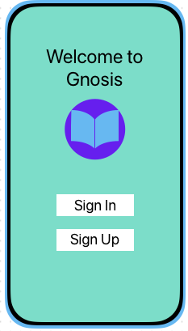
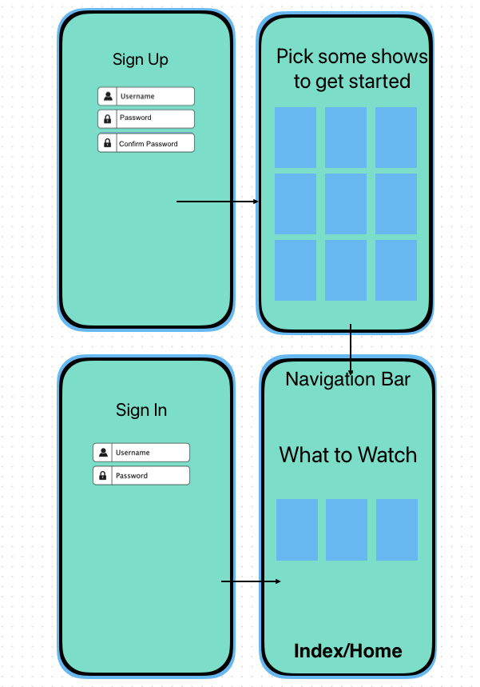
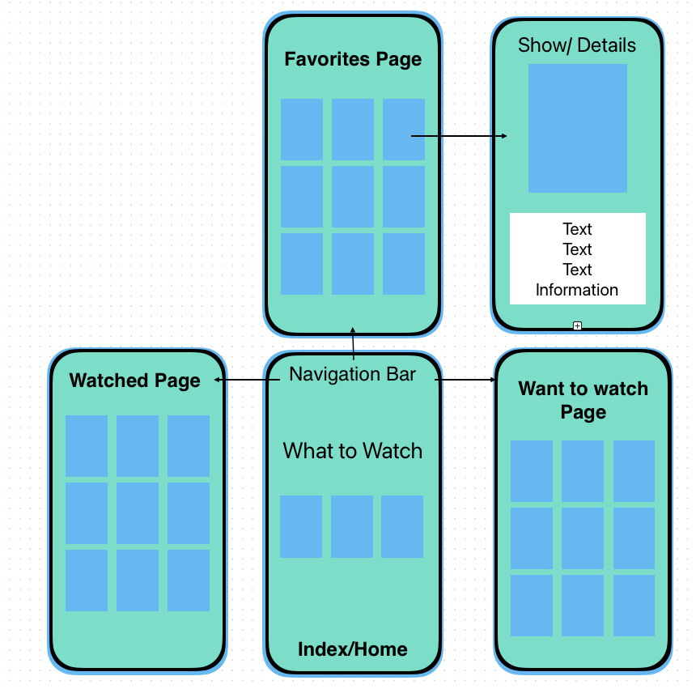
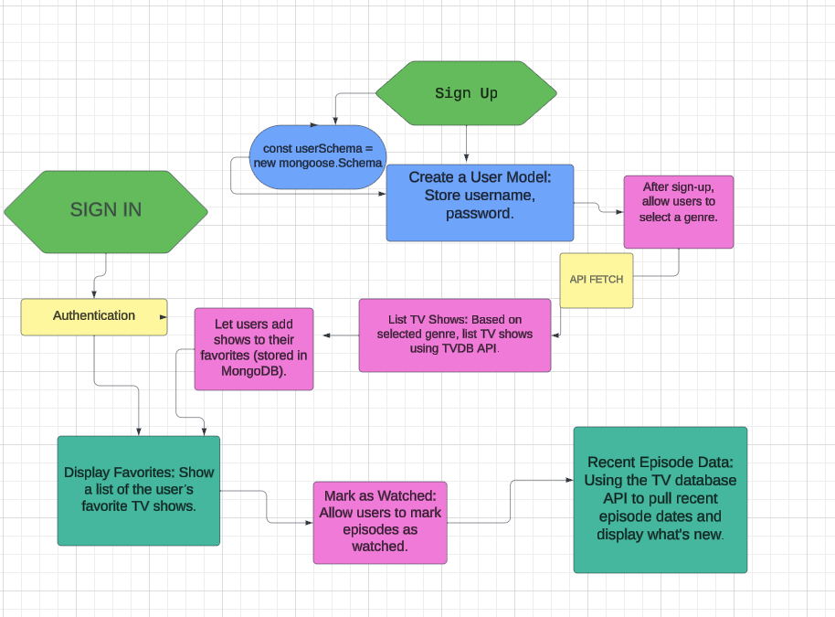
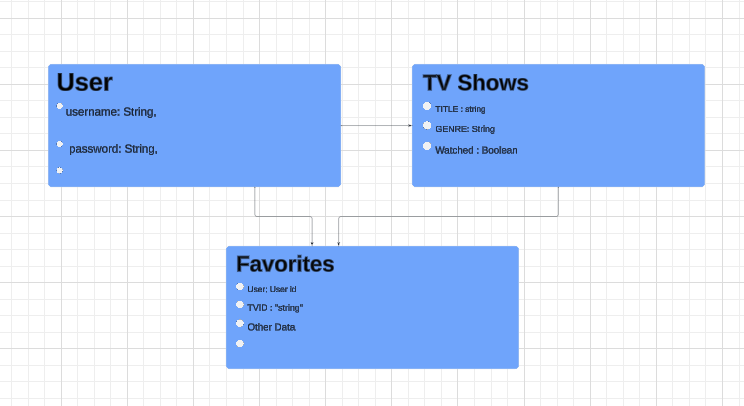

# _GNOSIS_
An app that helps you find and manage your favorite TV Shows

# **Overview**

_GNOSIS_ is an application designed to enhance the TV viewing experience for users by allowing them to discover, manage, and keep track of their favorite TV shows. 

### The Build

## User Stories
> - As a user, I want the ability to sign up.
> - As a user, I want the ability to sign in. 
> - As a user, I want the ability to change my password. 
> - As a user, I want the ability to sign out. 
> - As a user, I want to select from a list of shows based on genre
> - As a user, I want to mark shows as watched
> - As a user, I want to add favorite shows to my list
> - As a user, I want to see recent episode dates and what's new.
> - As a user, I want the ability to read more details about shows. 
> - As a user, I want the ability to delete shows from favorites. 
> - As a user, I want to enter my streaming service, to see if im subscribed for the service

## Key Features:
- User Registration: Secure sign-up process to create a personal account.
- Authentication: Ability to sign in and out, with password.
- Personalized: Users can choose shows based on their genre preferences, ensuring a customized viewing list.
- Favorites List: A dedicated space for users to add and maintain a list of their favorite TV shows.
- Watched Status: Users can mark shows as watched, helping to keep track of their viewing progress.
- Recent Updates: The app provides information on recent episode release dates and announcements of new content.
- Detailed Information: Extensive details are available for each show.
- List Management: Users have the ability to delete shows from their favorites, maintaining an up-to-date list.

## Possible Updates: 
- Service Compatibility: A feature that allows users to enter their current streaming services to check for show availability.

## Technologies Used
- **Backend:** Node.js with Express
- **Database:** MongoDB for data storage
- **Frontend:** EJS for templating
- **API Communication:** Axios for TVDB API requests

## Wireframes / Screenshots

### Log In or Sign Up

### Home Page and Navigation

## Entity Relationship Diagrams

